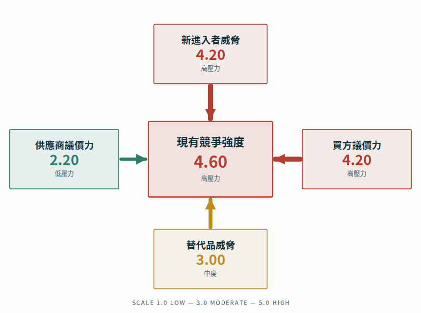
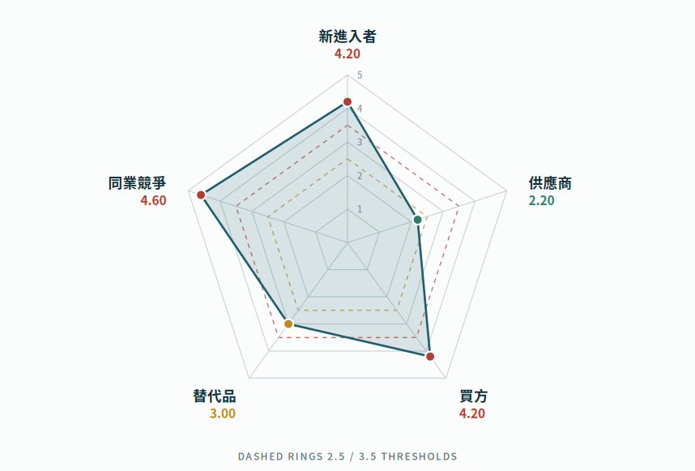

# 五力壓力量測 · 產業結構診斷工具

以 Michael E. Porter 五力架構為基礎的互動式產業結構診斷工具。透過 30 題一問一答，產出五力壓力羅盤、壓力雷達圖、規則式策略建議與可交付的 PDF 診斷報告。

純前端、零後端、可離線執行的 PWA，適用於產業輔導訪視、企業診斷、標案評估與教學演練。

**線上使用**：`https://<你的帳號>.github.io/<儲存庫名稱>/`

---

## 功能

| 功能 | 說明 |
|---|---|
| 一問一答量測 | 單題單屏、刻度式進度尺、可回上一題；按數字鍵 1–5 即可作答 |
| 五力壓力羅盤 | 箭頭粗細與色彩雙重編碼壓力強度，中央為現有競爭強度 |
| 壓力雷達圖 | 五軸雷達圖，含 2.5／3.5 判讀門檻虛線環 |
| 策略建議 | 15 組規則式建議（5 力 × 3 級壓力），共 45 項行動，各附所需資源與預估期程 |
| 追蹤 KPI | 各力對應 3 項可量測的監測指標 |
| 報告輸出 | 圖表輸出 2 倍解析度 PNG；A4 列印樣式可另存 PDF，含每頁固定頁首頁尾 |
| 署名與佐證 | 顧問署名欄、雙簽章欄位、分析方法與資料來源頁 |
| 離線可用 | Service Worker 快取應用殼層，斷網完整可用，可安裝至手機主畫面 |
| 案件管理 | 作答草稿自動保存與續作；已完成案件本機歸檔（上限 60 筆） |

### 五力壓力羅盤



### 壓力強度雷達圖



> 上圖為示範數據，非實際企業資料。

---

## 量測設計

| 項目 | 說明 |
|---|---|
| 題數 | 分析邊界設定 5 題（不計分）＋ 五力評分 25 題，合計 30 題 |
| 驅動因子 | 每一力設 5 項驅動因子，覆蓋 Porter 原始架構 |
| 量表 | 五點語意錨定量表，方向統一為「分數愈高＝該力對業者的壓力愈大」 |
| 單力分數 | 該力 5 項驅動因子之算術平均（預設等權） |
| 產業吸引力指數 | 6 −（五力平均分數），區間 1.00–5.00，數值愈高代表結構性獲利空間愈大 |
| 判讀門檻 | ≤ 2.4 低壓力｜2.5–3.4 中度｜≥ 3.5 高壓力 |
| 建議生成 | 規則式對應，非統計推論或預測模型 |

### 題庫結構

| 五力構面 | 5 項驅動因子 |
|---|---|
| 新進入者威脅 | 規模經濟門檻／資本與設備投入／品牌與客戶轉換成本／通路與供應鏈取得／法規證照與政策門檻 |
| 供應商議價力 | 供應商家數與集中度／關鍵投入不可替代性／更換供應商成本／前向整合威脅／採購量對供應商的份量 |
| 買方議價力 | 客戶集中度／產品服務標準化程度／客戶轉換成本／價格敏感度與比價行為／客戶後向整合可能 |
| 替代品威脅 | 替代方案性價比／改用替代品的轉換成本／跨業與數位替代速度／客戶接受替代的意願／替代技術成熟度 |
| 現有競爭強度 | 競爭者數量與規模均衡度／市場成長率／固定成本與產能壓力／差異化程度／退出障礙 |

---

## 部署到 GitHub Pages

Service Worker 需在 HTTPS 或 `localhost` 環境下才會註冊，GitHub Pages 預設提供 HTTPS，可直接使用。

### 方式一：網頁介面上傳（免安裝 Git）

1. 於 GitHub 建立新的**公開**儲存庫，例如 `five-forces-diagnostic`
2. 點選 **Add file → Upload files**，將本專案所有檔案與 `assets/` 資料夾一併拖曳上傳
3. 進入 **Settings → Pages**
4. **Source** 選擇 `Deploy from a branch`，**Branch** 選擇 `main`、資料夾選擇 `/ (root)`，按 **Save**
5. 等候約 1–2 分鐘，頁面上方會顯示網址 `https://<帳號>.github.io/<儲存庫名稱>/`

### 方式二：Git 指令列

```bash
cd five-forces-diagnostic
git init
git add .
git commit -m "feat: 五力壓力量測診斷工具 v1.0.0"
git branch -M main
git remote add origin https://github.com/<帳號>/<儲存庫名稱>.git
git push -u origin main
```

推送完成後，同樣至 **Settings → Pages** 設定 Branch 為 `main` / `root`。

### 注意事項

- **儲存庫可見性**：GitHub Pages 在私人儲存庫需 GitHub Pro、Team 或 Enterprise 方案；免費方案請使用公開儲存庫
- **路徑設定**：本專案全部採相對路徑（`./`），置於任何子目錄皆可正常運作，無須修改
- **`.nojekyll`**：已內含，避免 GitHub Pages 的 Jekyll 處理程序影響靜態檔案
- **字型**：介面字型透過 Google Fonts 載入，首次連線後由 Service Worker 快取；若在完全封閉的內網環境使用，將自動退回系統中文字型，不影響功能

---

## 更新版本

修改程式後，**務必同步調高 `sw.js` 第一行的快取版號**，否則使用者端會繼續載入舊版快取：

```js
const CACHE = "ff5-v2";   // 由 v1 改為 v2
```

---

## 本機測試

直接以瀏覽器開啟 `index.html` 即可使用（僅離線快取與安裝功能不啟用）。若要完整測試 PWA 行為：

```bash
python3 -m http.server 8000
# 瀏覽 http://localhost:8000
```

---

## 目錄結構

```
.
├── index.html              # 主程式（題庫、計分、圖表、報告皆內含）
├── manifest.json           # PWA 應用程式資訊與圖示定義
├── sw.js                   # Service Worker（離線快取）
├── icon-192.png            # 應用程式圖示
├── icon-512.png
├── icon-maskable.png       # Android 自適應圖示
├── .nojekyll               # 停用 GitHub Pages 的 Jekyll 處理
├── assets/                 # README 用示意圖
├── CHANGELOG.md
└── README.md
```

---

## 資料與隱私

- 所有作答內容、案件紀錄與報告資料**僅儲存於使用者裝置的瀏覽器本機空間**，不會傳送至任何伺服器
- 本專案無後端、無資料庫、無使用者追蹤、無第三方分析程式碼
- 清除瀏覽器資料或更換裝置將一併移除已儲存案件，重要報告請於產出後另存 PDF 保管

---

## 分析架構依據

- Porter, M. E. (1979). How Competitive Forces Shape Strategy. *Harvard Business Review*, 57(2), 137–145.
- Porter, M. E. (1980). *Competitive Strategy: Techniques for Analyzing Industries and Competitors*. New York: Free Press.
- Porter, M. E. (2008). The Five Competitive Forces That Shape Strategy. *Harvard Business Review*, 86(1), 25–40.

### 建議補充之外部佐證來源

| 佐證類型 | 建議查證來源 |
|---|---|
| 產業規模與家數 | 經濟部統計處工業及服務業普查、財政部財政資訊中心營利事業家數統計 |
| 同業財務比較 | 公開資訊觀測站財報、TEJ 台灣經濟新報、經濟部中小企業處統計 |
| 技術與替代趨勢 | 資策會 MIC、工研院產科國際所（IEK）、經濟部技術處研究報告 |
| 進出口與市場動向 | 財政部關務署進出口貿易統計、國貿署貿易統計資料庫 |
| 法規與政策門檻 | 全國法規資料庫、主管機關公告與許可辦法 |

---

## 免責聲明

本工具之五力評分係由受評單位或訪視顧問依現況**主觀自評**產生，屬結構性初步判讀，不構成投資、財務或法律建議。正式輔導建議、投資決策或標案評估之引用，應併同上述外部佐證來源、受評單位實際財務數據與同業標竿進行交叉驗證後定案。

報告中「所需資源」之人月數與「預估期程」為規劃層級參考值，須依受評單位規模、現有職能配置與資源條件調整後定案。

---

## 授權

尚未指定。建議於公開發布前依委辦契約與智慧財產權歸屬條款確認後補上 `LICENSE` 檔案。常見選項：

| 授權 | 適用情境 |
|---|---|
| MIT | 允許自由使用、修改與再散布，僅需保留著作權聲明；適合希望最大化擴散的公版工具 |
| CC BY-NC 4.0 | 允許非商業使用與改作，須姓名標示；適合政府計畫成果的公益推廣 |
| 保留所有權利 | 不加授權檔案，僅供指定對象使用；適合尚在委辦契約管制期內的成果 |

若本工具屬政府補助或委辦計畫成果，其著作財產權歸屬與授權方式應依計畫契約辦理。
